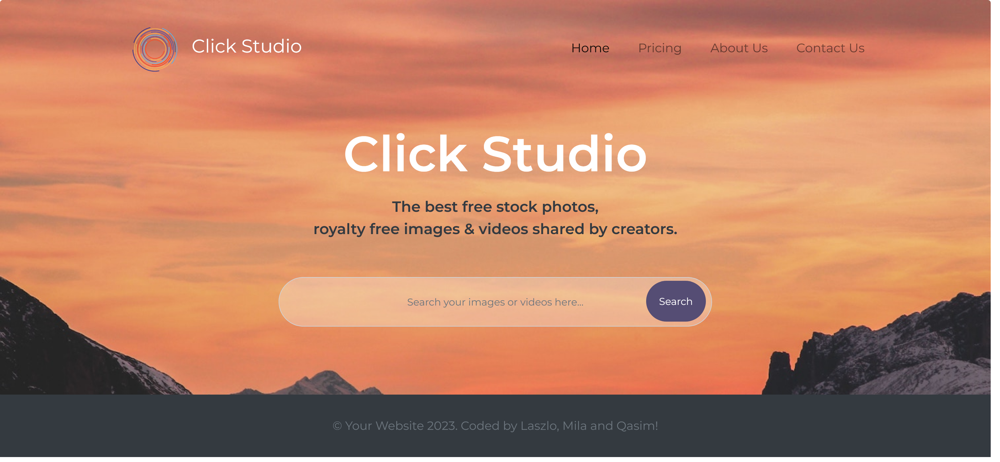
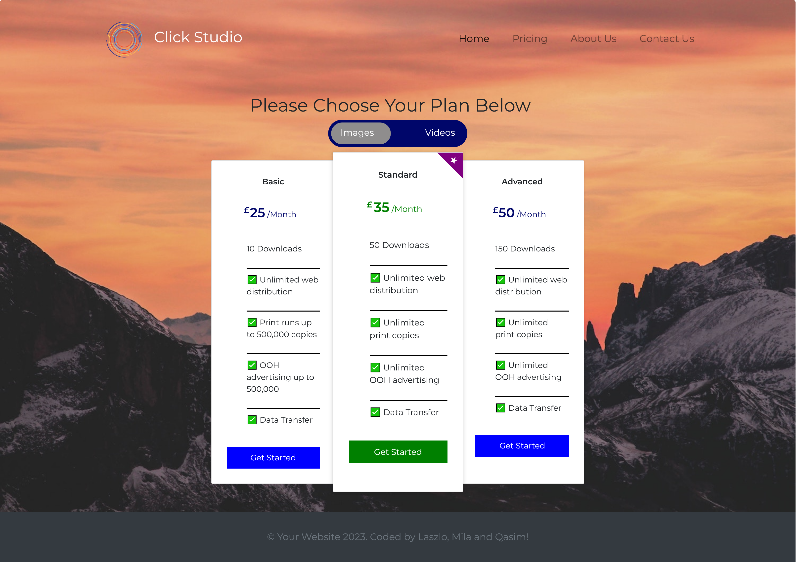

# Click-Studio

## Description
“Click Studio” is a web application, which provides access to a library of high-quality media files - images and videos. The app helps creative professionals and businesses to produce their best work with unique content, all on one platform. The app helps the users to find great photos and videos that can be downloaded and used for a fee.
The most outstanding quality of the app is that search for images and videos at the same time.

## Live URL
https://milla56.github.io/Click-Studio/index.html 

## Mockup
- Main Page

- Price Page

## Team Members
- HTML: Lubomila Luzanova https://github.com/milla56/ 
- CSS: Qasim Muhammad https://github.com/Qasim538
- JavaScript: Laszlo Somogyi https://github.com/laszlosomogyimusic